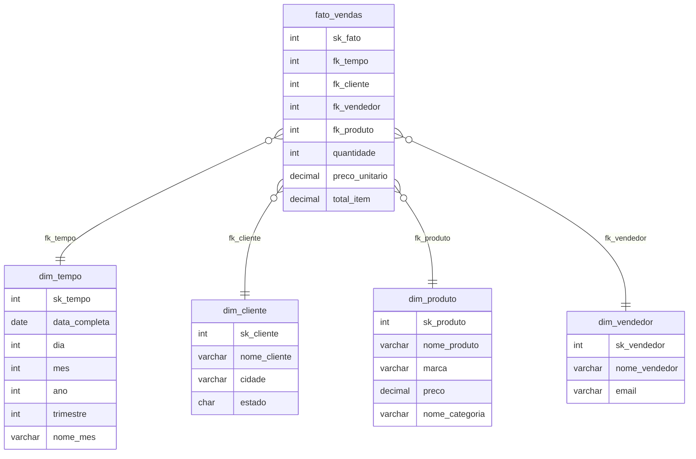

# 👟 Loja de Sapatos — Projeto de Banco de Dados (P3)

Projeto da **3ª avaliação (P3)** de Banco de Dados. O sistema simula a operação de uma loja de sapatos e demonstra a separação entre o ambiente **transacional (OLTP)** e o ambiente **analítico (Data Warehouse)**, usando **Views** para montar um modelo dimensional (star schema) e uma **Trigger** para auditoria de exclusões.

> Tecnologia: **SQL Server (T-SQL)**

---

## 📌 Visão Geral

O projeto é dividido em dois bancos:

| Banco | Tipo | Descrição |
|-------|------|-----------|
| `db_sapatos_producao` | OLTP (Produção) | Tabelas normalizadas com os dados do dia a dia da loja |
| `db_sapatos_dw` | OLAP (Data Warehouse) | Modelo dimensional em *star schema*, montado a partir de **Views** sobre o banco de produção |

A ligação entre os dois bancos é feita por **consultas entre bancos** (ex.: `db_sapatos_producao.dbo.vendas`) e por uma **Trigger** que registra produtos excluídos.

---

## 🗂️ Estrutura dos Scripts

| Arquivo | Conteúdo |
|---------|----------|
| `BD01_sapatos.sql` | Cria o banco de **produção**, todas as tabelas, as chaves estrangeiras e insere os **dados de exemplo** |
| `BD02_sapatos.sql` | Cria o banco **DW**, as **Views** dimensionais e de fato, a tabela de **log**, a **Trigger** e as **consultas de validação** |

> ⚠️ Execute **sempre** o `BD01` antes do `BD02`, pois o Data Warehouse depende das tabelas de produção.

---

## 🏭 Banco de Produção (`db_sapatos_producao`)

Modelo relacional normalizado com 6 tabelas:

- **clientes** — dados dos clientes (cidade, estado, contato)
- **categorias** — tipos de calçado (Tênis, Social, Sandália, Bota, Chinelo)
- **produtos** — sapatos cadastrados (marca, preço, estoque)
- **vendedores** — equipe de vendas
- **vendas** — cabeçalho da venda (cliente, vendedor, data, total)
- **itens_venda** — itens de cada venda (produto, quantidade, preço unitário)

Relacionamentos por **chave estrangeira**:

```
clientes ──< vendas >── vendedores
                │
                └──< itens_venda >── produtos >── categorias
```

---

## ⭐ Data Warehouse (`db_sapatos_dw`)

Modelo dimensional em **Star Schema**, montado inteiramente com **Views** (a tabela fato e as dimensões são consultas sobre o banco de produção, sem duplicar fisicamente os dados).



### Views criadas

| View | Tipo | Função |
|------|------|--------|
| `dim_tempo` | Dimensão | Quebra a data da venda em dia, mês, ano, trimestre e nome do mês. A *surrogate key* (`sk_tempo`) é gerada no formato `AAAAMMDD` |
| `dim_cliente` | Dimensão | Cliente, cidade e estado |
| `dim_produto` | Dimensão | Produto + categoria (faz o `JOIN` de produtos com categorias) |
| `dim_vendedor` | Dimensão | Dados do vendedor |
| `fato_vendas` | Fato | Liga itens, vendas, clientes, vendedores e produtos; calcula `total_item = quantidade × preço_unitário` |

---

## 🔔 Trigger de Auditoria

A trigger **`trg_log_produto_deletado`** fica na tabela `produtos` (banco de produção) e dispara `AFTER DELETE`.

Sempre que um produto é excluído, ela grava automaticamente um registro na tabela **`log_produtos_deletados`** (no banco DW), guardando:

- `produto_id`
- `nome`
- `preco`
- `deletado_em` (data/hora da exclusão)

Isso garante **rastreabilidade**: mesmo após o produto sumir da produção, o histórico da exclusão permanece registrado.

---

## ✅ Consultas de Validação

O script `BD02` já inclui consultas que comprovam o funcionamento do DW:

- Receita total por **categoria**
- Receita total por **vendedor**
- Receita total por **mês/ano**
- Teste prático da **trigger** (insere, deleta e mostra o log gerado)

---

## ▶️ Como Executar

1. Abra o **SQL Server Management Studio (SSMS)** ou o **Azure Data Studio**.
2. Execute o script de produção:
   ```sql
   -- BD01_sapatos.sql
   ```
3. Execute o script do Data Warehouse e validações:
   ```sql
   -- BD02_sapatos.sql
   ```
4. Veja os resultados das consultas de validação e o teste da trigger na aba de mensagens/resultados.

> Cada script já trata o `DROP DATABASE` caso o banco exista, então pode ser reexecutado do zero quantas vezes precisar.

---

## 🛠️ Tecnologias e Conceitos

- **SQL Server / T-SQL**
- Modelagem **OLTP** (normalizada) x **OLAP** (dimensional)
- **Star Schema** (tabela fato + dimensões)
- **Views** como camada de modelagem dimensional
- **Triggers** (`AFTER DELETE`) para auditoria
- Consultas **cross-database**
- Funções de data (`DATEPART`, `CONVERT`, `YEAR`, `MONTH`)

---

## 👥 Autores

Projeto acadêmico desenvolvido para a disciplina de **Banco de Dados**.

Duplas: Diego Hardman e Arthur cursino 
